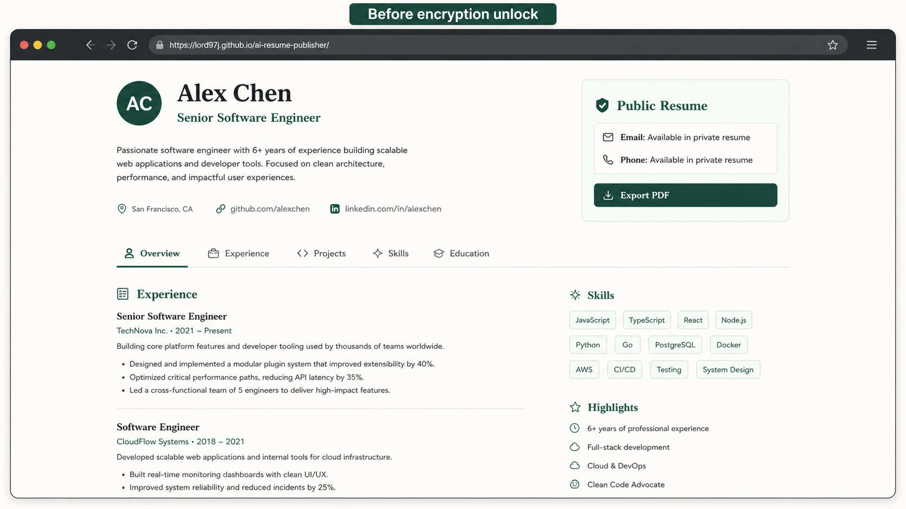
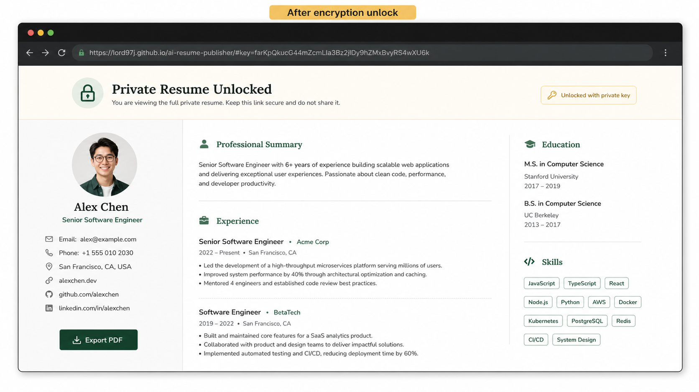
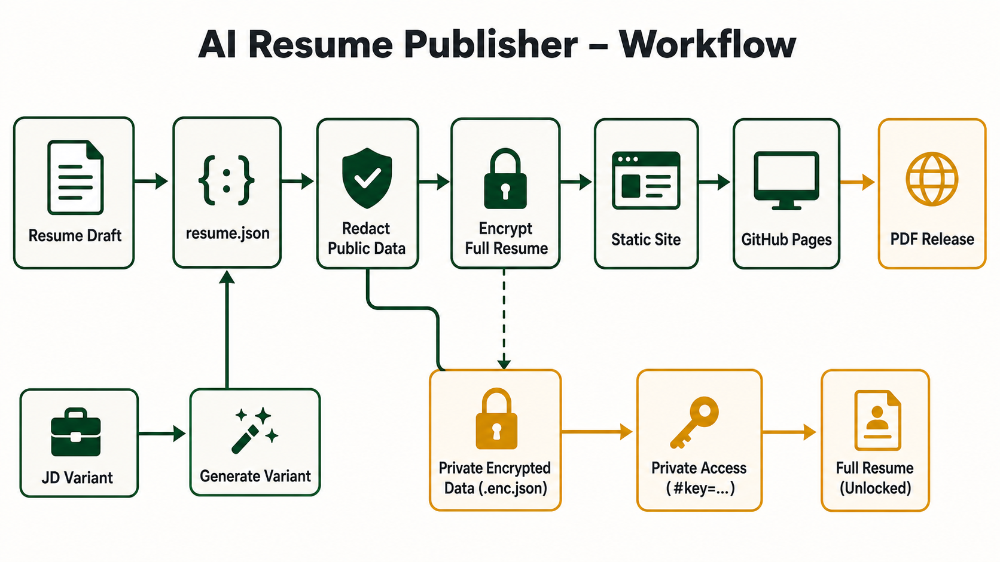

# AI Resume Publisher

[中文文档](README.zh-CN.md)


[](https://lord97j.github.io/ai-resume-publisher/)
[](https://github.com/lord97j/ai-resume-publisher/releases/latest)
[](LICENSE)
[](package.json)

Generate, tailor, encrypt, publish, and export AI resume pages from Git branches.

**AI Resume Publisher** is an open-source starter for job seekers who want a Git-native personal resume homepage. It ships as a static-site template plus an AI/Codex skill: the public `main` branch hosts a redacted resume, while each job description can become a tailored branch or variant with its own preview, PDF, and review notes.

[Quick Start](#quick-start) • [How It Works](#how-it-works) • [Search Tools](#search-tools) • [Documentation](#documentation) • [Configuration](#configuration) • [Troubleshooting](#troubleshooting) • [License](#open-source-license)

## Demo

Public resume:
[https://lord97j.github.io/ai-resume-publisher/](https://lord97j.github.io/ai-resume-publisher/)

Encrypted full resume:
[https://lord97j.github.io/ai-resume-publisher/#key=farKpQkucG44mZcmLIa3Bz2jlDy9hZMxBvyRS4wXU6k](https://lord97j.github.io/ai-resume-publisher/#key=farKpQkucG44mZcmLIa3Bz2jlDy9hZMxBvyRS4wXU6k)

Latest timestamped PDF:
[GitHub Releases](https://github.com/lord97j/ai-resume-publisher/releases/latest)

### Privacy States

Before private unlock:



After private unlock:



## Quick Start

Clone and build:

```bash
git clone git@github.com:lord97j/ai-resume-publisher.git
cd ai-resume-publisher
npm run build
```

Open `dist/index.html` or serve `dist/` with any static server.

Create an encrypted full-resume payload:

```bash
npm run encrypt
npm run build
```

The command prints a private URL suffix:

```txt
/#key=<base64url-key>
```

Build a tailored resume variant from a JD:

```bash
npm run tailor -- --jd examples/frontend-jd.md --slug acme-frontend
npm run build -- --variant acme-frontend
```

Export a timestamped PDF:

```bash
npm run export:pdf
```

The PDF is written to `release/resume-<version>.pdf`.

## Skill Installation

Install the skill locally for Codex-style agents:

```bash
mkdir -p ~/.codex/skills/ai-resume-publisher
cp SKILL.md ~/.codex/skills/ai-resume-publisher/SKILL.md
```

For active development, symlink the project instead:

```bash
mkdir -p ~/.codex/skills
ln -s "$PWD" ~/.codex/skills/ai-resume-publisher
```

Then ask your agent:

```txt
Use the AI Resume Publisher skill.
Read my resume draft, generate resume.json, publish the public page,
then tailor a private branch for this JD.
```

## How It Works



Core ideas:

- `main` is the public resume homepage.
- Sensitive fields are redacted before publishing.
- Full resume data is stored as AES-GCM ciphertext.
- The decryption key lives in the URL fragment, so it is not sent to GitHub Pages.
- JD-specific versions live in `variants/<company-role>/` or Git branches.
- GitHub Actions publishes Pages and attaches PDFs to timestamped Releases.

## Search Tools

This project is designed for agent-friendly discovery. The skill should inspect these files first:

| Surface | Purpose |
|---|---|
| `resume.json` | Canonical resume data |
| `publisher.redact` | Public redaction policy |
| `variants/<slug>/resume.json` | JD-specific resume variant |
| `variants/<slug>/jd.md` | Original target JD |
| `variants/<slug>/notes.md` | What changed and what needs review |
| `public/private-resume.enc.json` | Public ciphertext for private unlock |
| `release/resume-*.pdf` | Local PDF export artifacts |
| GitHub Releases | Published PDF history by time and commit |

Useful commands:

```bash
rg "publisher|redact|variant" resume.json variants
gh release list --repo <owner>/<repo> --limit 10
gh run list --repo <owner>/<repo> --limit 5
gh api repos/<owner>/<repo>/pages
```

## Documentation

| Topic | File / Command |
|---|---|
| Skill workflow | [`SKILL.md`](SKILL.md) |
| Chinese documentation | [`README.zh-CN.md`](README.zh-CN.md) |
| Resume schema sample | [`resume.json`](resume.json) |
| Static builder | [`scripts/build.js`](scripts/build.js) |
| JD variant generator | [`scripts/tailor.js`](scripts/tailor.js) |
| Redaction helpers | [`scripts/redact.js`](scripts/redact.js) |
| Encryption | [`scripts/encrypt.js`](scripts/encrypt.js) |
| PDF export | [`scripts/export-pdf.js`](scripts/export-pdf.js) |
| GitHub Pages workflow | [`.github/workflows/pages.yml`](.github/workflows/pages.yml) |

## Configuration

### Resume Data

Edit `resume.json`. The shape is compatible with the spirit of JSON Resume and adds a `publisher` block:

```json
{
  "publisher": {
    "redact": ["email", "phone", "location"],
    "template": "minimal-html",
    "tone": "credible, concise, evidence-first"
  }
}
```

### Redaction

Use `publisher.redact` to decide which fields are hidden on the public page. The default public homepage hides direct contact fields and keeps public profile links visible.

### Encryption

Run:

```bash
npm run encrypt
```

Commit `public/private-resume.enc.json`; do **not** commit or paste the printed `#key=...` into issues, PRs, README examples for real resumes, or public logs.

### GitHub Pages and Releases

Enable Pages in workflow mode:

```bash
gh api -X POST repos/<owner>/<repo>/pages \
  -f build_type=workflow \
  -f 'source[branch]=main' \
  -f 'source[path]=/'
```

Push `main`. The workflow will:

1. build `dist/`;
2. export `resume-YYYY.MM.DD.HHMM-<short-sha>.pdf`;
3. upload the PDF to a GitHub Release;
4. deploy GitHub Pages.

## Output Results

After a successful publish, you should have:

```txt
Public URL:
https://<owner>.github.io/<repo>/

Encrypted URL:
https://<owner>.github.io/<repo>/#key=<base64url-key>

PDF history:
https://github.com/<owner>/<repo>/releases

Latest PDF:
https://github.com/<owner>/<repo>/releases/latest
```

For this repository:

- Public URL: [https://lord97j.github.io/ai-resume-publisher/](https://lord97j.github.io/ai-resume-publisher/)
- Latest PDF: [https://github.com/lord97j/ai-resume-publisher/releases/latest](https://github.com/lord97j/ai-resume-publisher/releases/latest)

## Troubleshooting

| Problem | Fix |
|---|---|
| `Get Pages site failed` | Enable Pages with `gh api -X POST repos/<owner>/<repo>/pages -f build_type=workflow ...` |
| Pages returns `404` | Wait for the workflow to finish, then check `gh api repos/<owner>/<repo>/pages` |
| Private unlock fails | Make sure `public/private-resume.enc.json` matches the printed `#key=...` from the same `npm run encrypt` run |
| PDF export cannot find Chrome | Set `CHROME_BIN=/path/to/chrome` and rerun `npm run export:pdf` |
| Release was not created | Check `gh run view <run-id> --log-failed` and repository `contents: write` workflow permission |
| Public page shows private data | Review `publisher.redact`, rerun `npm run build`, and inspect `dist/index.html` before publishing |

## Roadmap

- More templates for engineers, product managers, researchers, designers, and students.
- Stronger JD tailoring reports with keyword coverage.
- Branch-based Vercel preview helpers.
- Bilingual resume output.
- Optional ATS-friendly plain HTML mode.

## Open Source License

This project is open source under the [MIT License](LICENSE).
