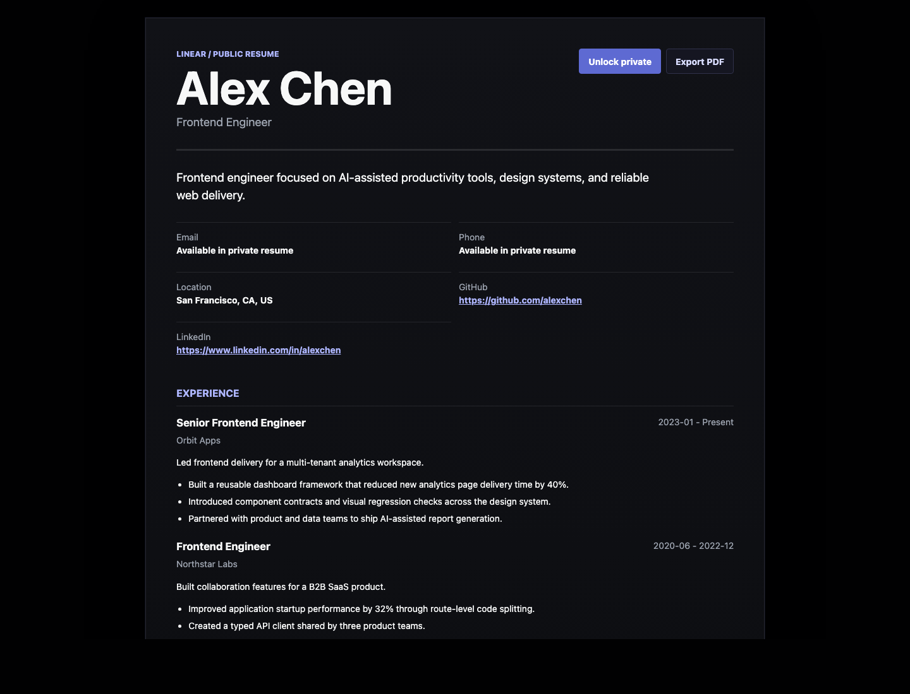
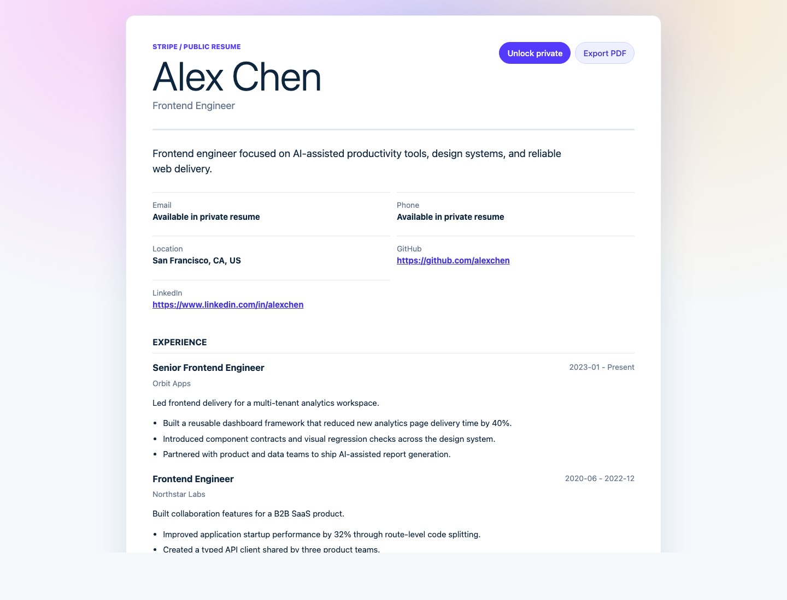
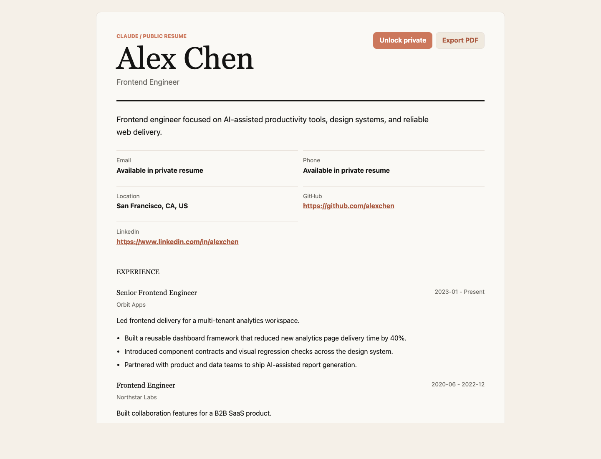
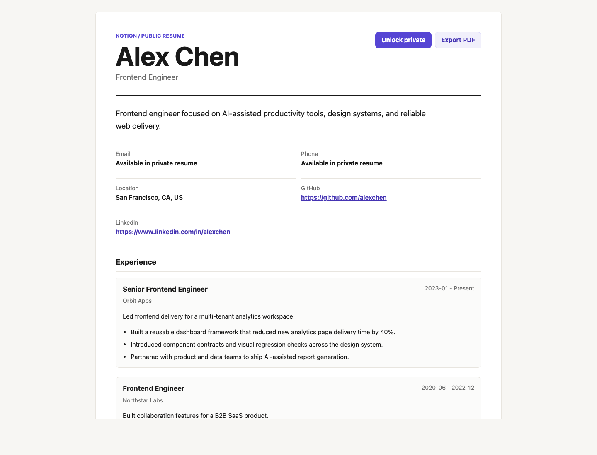
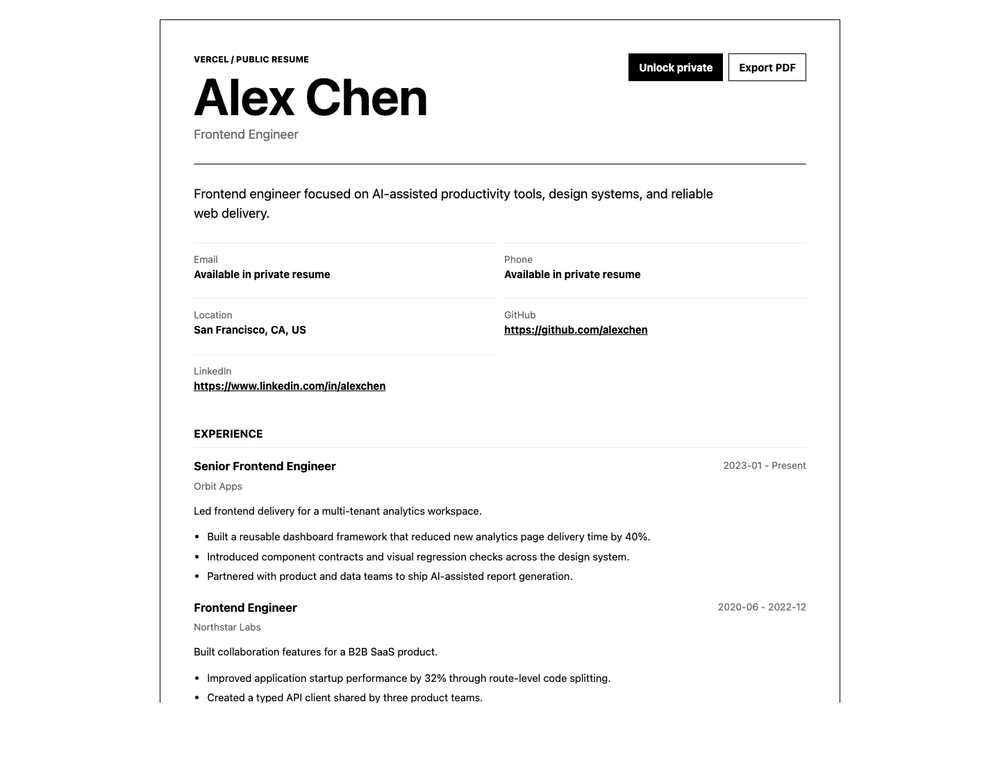

# AI Resume Publisher 中文说明

[English README](README.md)


[](https://lord97j.github.io/ai-resume-publisher/)
[](https://github.com/lord97j/ai-resume-publisher/releases/latest)
[](LICENSE)
[](package.json)

AI Resume Publisher 是一个面向求职者的开源简历发布系统：用 `resume.json` 作为主数据源，通过 AI/Codex skill 生成静态个人简历主页，并支持 JD 定制版本、GitHub Pages 发布、私密完整简历加密访问，以及按时间和提交版本输出 PDF 到 GitHub Releases。

[快速开始](#快速开始) • [风格展示](#风格展示) • [工作原理](#工作原理) • [搜索工具](#搜索工具) • [文档](#文档) • [配置](#配置) • [排障](#排障) • [开源协议](#开源协议)

## Demo

公开简历主页：
[https://lord97j.github.io/ai-resume-publisher/](https://lord97j.github.io/ai-resume-publisher/)

加密完整简历：
[https://lord97j.github.io/ai-resume-publisher/#key=farKpQkucG44mZcmLIa3Bz2jlDy9hZMxBvyRS4wXU6k](https://lord97j.github.io/ai-resume-publisher/#key=farKpQkucG44mZcmLIa3Bz2jlDy9hZMxBvyRS4wXU6k)

最新版 PDF：
[GitHub Releases](https://github.com/lord97j/ai-resume-publisher/releases/latest)

### 加密前后展示

加密解锁前：


加密解锁后：


## 风格展示

项目内置 5 种简历风格，设计依据来自本仓库 `design-md/` 中保存的 `awesome-design-md` 设计文件。

| 风格 | 适合岗位 | 分支 | 构建命令 |
|---|---|---|---|
| Linear | 后端、架构、安全、基础设施 | `style/linear` | `npm run build -- --style linear` |
| Stripe | PM、增长、技术销售、SaaS 全栈 | `style/stripe` | `npm run build -- --style stripe` |
| Claude | AI 研究、内容、市场策划、提示词工程 | `style/claude` | `npm run build -- --style claude` |
| Notion | 运营、项目管理、行政、职场新人 | `style/notion` | `npm run build -- --style notion` |
| Vercel | 前端、UI/UX、初创团队通用人才 | `style/vercel` | `npm run build -- --style vercel` |

Linear：



Stripe：



Claude：



Notion：



Vercel：



## 快速开始

```bash
git clone git@github.com:lord97j/ai-resume-publisher.git
cd ai-resume-publisher
npm run build
```

生成加密完整简历：

```bash
npm run encrypt
npm run build
```

命令会输出私密访问后缀：

```txt
/#key=<base64url-key>
```

生成 JD 定制版本：

```bash
npm run tailor -- --jd examples/frontend-jd.md --slug acme-frontend
npm run build -- --variant acme-frontend
```

指定视觉风格构建：

```bash
npm run build -- --style linear
npm run build -- --style stripe
npm run build -- --style claude
npm run build -- --style notion
npm run build -- --style vercel
```

根据岗位推荐风格：

```bash
node scripts/recommend-style.js --role "后端架构师"
node scripts/recommend-style.js --role "AI 研究"
```

导出带时间版本的 PDF：

```bash
npm run export:pdf
```

PDF 会写入 `release/resume-<version>.pdf`。

## Skill 安装

```bash
mkdir -p ~/.codex/skills/ai-resume-publisher
cp SKILL.md ~/.codex/skills/ai-resume-publisher/SKILL.md
```

开发时也可以用软链接：

```bash
mkdir -p ~/.codex/skills
ln -s "$PWD" ~/.codex/skills/ai-resume-publisher
```

使用时可以对 agent 说：

```txt
使用 AI Resume Publisher skill。
读取我的初版简历，生成 resume.json，发布公开脱敏主页，
再根据这个 JD 生成一个定制简历版本。
```

## 工作原理


核心思路：

- `main` 是公开简历主页。
- 发布前自动脱敏邮箱、电话、地址等敏感字段。
- 完整简历数据用 AES-GCM 加密后作为公开密文托管。
- 解密密钥放在 URL fragment，也就是 `#key=...`，不会发送给 GitHub Pages。
- JD 定制版本放在 `variants/<company-role>/` 或 Git 分支里。
- GitHub Actions 自动发布 Pages，并把 PDF 附加到按时间命名的 Releases。

## 搜索工具

Agent 或维护者应该优先查看这些位置：

| 位置 | 用途 |
|---|---|
| `resume.json` | 主简历数据 |
| `publisher.redact` | 公开页脱敏策略 |
| `variants/<slug>/resume.json` | JD 定制简历 |
| `variants/<slug>/jd.md` | 原始岗位 JD |
| `variants/<slug>/notes.md` | 调整说明和人工审核点 |
| `public/private-resume.enc.json` | 私密简历密文 |
| `release/resume-*.pdf` | 本地 PDF 导出物 |
| GitHub Releases | 线上 PDF 历史版本 |

常用命令：

```bash
rg "publisher|redact|variant" resume.json variants
gh release list --repo <owner>/<repo> --limit 10
gh run list --repo <owner>/<repo> --limit 5
gh api repos/<owner>/<repo>/pages
```

## 文档

| 主题 | 文件 / 命令 |
|---|---|
| Skill 工作流 | [`SKILL.md`](SKILL.md) |
| 英文文档 | [`README.md`](README.md) |
| 简历数据样例 | [`resume.json`](resume.json) |
| 风格设计文件 | [`design-md/`](design-md/README.md) |
| 静态站点构建 | [`scripts/build.js`](scripts/build.js) |
| 风格推荐脚本 | [`scripts/recommend-style.js`](scripts/recommend-style.js) |
| JD 变体生成 | [`scripts/tailor.js`](scripts/tailor.js) |
| 脱敏逻辑 | [`scripts/redact.js`](scripts/redact.js) |
| 加密逻辑 | [`scripts/encrypt.js`](scripts/encrypt.js) |
| PDF 导出 | [`scripts/export-pdf.js`](scripts/export-pdf.js) |
| GitHub Pages workflow | [`.github/workflows/pages.yml`](.github/workflows/pages.yml) |

## 配置

### 简历数据

编辑 `resume.json`。数据结构兼容 JSON Resume 的思路，并扩展了 `publisher` 配置：

```json
{
  "publisher": {
    "redact": ["email", "phone", "location"],
    "template": "linear",
    "tone": "credible, concise, evidence-first"
  }
}
```

支持的 `publisher.template`：

```txt
minimal-html
linear
stripe
claude
notion
vercel
```

### 脱敏

用 `publisher.redact` 控制公开页隐藏哪些字段。默认会隐藏直接联系方式，并保留公开 profile 链接。

### 加密

```bash
npm run encrypt
```

可以提交 `public/private-resume.enc.json`，因为它是密文；不要把真实 `#key=...` 提交到 issue、PR、README 示例或公开日志里。

### GitHub Pages 和 Releases

启用 workflow 模式的 GitHub Pages：

```bash
gh api -X POST repos/<owner>/<repo>/pages \
  -f build_type=workflow \
  -f 'source[branch]=main' \
  -f 'source[path]=/'
```

推送 `main` 后，workflow 会：

1. 构建 `dist/`；
2. 导出 `resume-YYYY.MM.DD.HHMM-<short-sha>.pdf`；
3. 上传 PDF 到 GitHub Release；
4. 部署 GitHub Pages。

## 输出结果

发布成功后会得到：

```txt
公开简历主页：
https://<owner>.github.io/<repo>/

加密完整简历：
https://<owner>.github.io/<repo>/#key=<base64url-key>

PDF 历史版本：
https://github.com/<owner>/<repo>/releases

最新 PDF：
https://github.com/<owner>/<repo>/releases/latest
```

当前仓库：

- 公开主页：[https://lord97j.github.io/ai-resume-publisher/](https://lord97j.github.io/ai-resume-publisher/)
- 最新 PDF：[https://github.com/lord97j/ai-resume-publisher/releases/latest](https://github.com/lord97j/ai-resume-publisher/releases/latest)

## 排障

| 问题 | 处理方式 |
|---|---|
| `Get Pages site failed` | 用 `gh api -X POST repos/<owner>/<repo>/pages -f build_type=workflow ...` 启用 Pages |
| Pages 返回 `404` | 等 workflow 完成后，运行 `gh api repos/<owner>/<repo>/pages` |
| 私密解锁失败 | 确认 `public/private-resume.enc.json` 和 `#key=...` 来自同一次 `npm run encrypt` |
| PDF 导出找不到 Chrome | 设置 `CHROME_BIN=/path/to/chrome` 后重试 `npm run export:pdf` |
| Release 没生成 | 用 `gh run view <run-id> --log-failed` 查看日志，并检查 workflow `contents: write` 权限 |
| 公开页露出敏感信息 | 检查 `publisher.redact`，重新 `npm run build`，发布前检查 `dist/index.html` |

## 路线图

- 更多岗位模板：工程师、产品经理、研究员、设计师、学生。
- 更完整的 JD 关键词覆盖报告。
- Vercel 分支预览辅助命令。
- 中英双语简历输出。
- ATS 友好的纯 HTML 模式。

## 开源协议

本项目基于 [MIT License](LICENSE) 开源。
